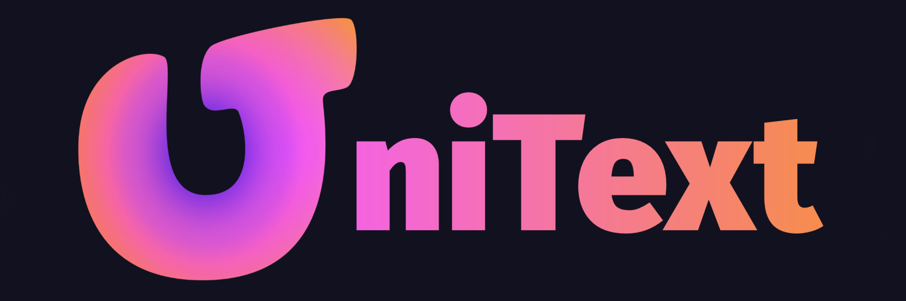
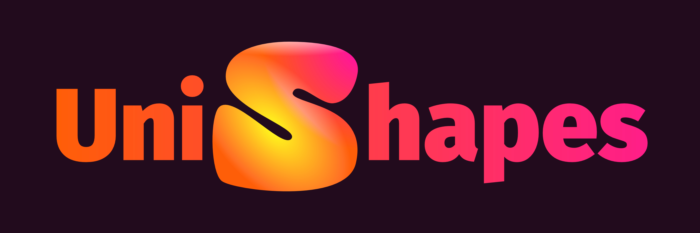
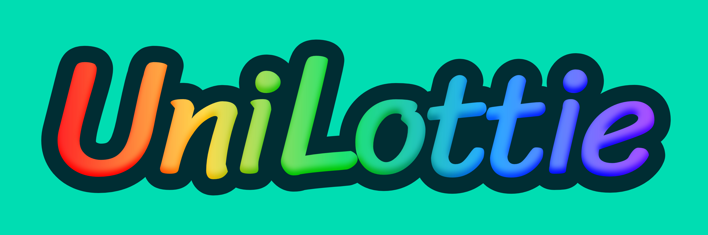
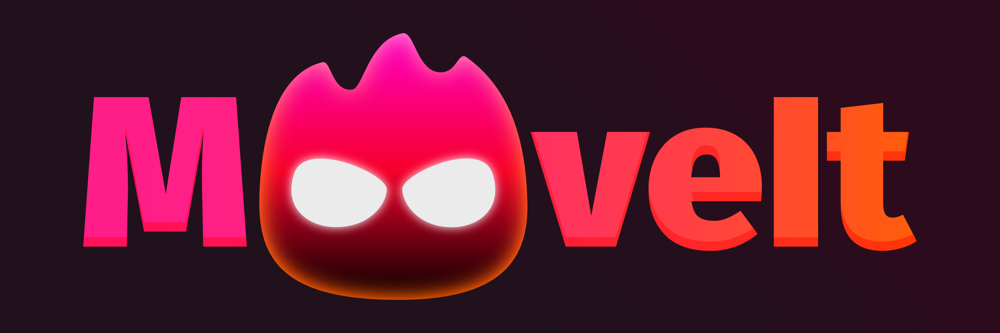

  

<h1 align="center">LightSide Ecosystem</h1>

<strong>Text. Shapes. Animation. One creative ecosystem for Unity.</strong>

  
  
  

  
  &nbsp;
  

  <a href="#products">Explore the products</a>
  &nbsp; · &nbsp;
  <a href="https://unity.lightside.media">Documentation &amp; licences</a>
  &nbsp; · &nbsp;
  <a href="https://github.com/LightSideKittens/LightSideEcosystem/releases">Hub releases</a>

> [!TIP]
> **Discord is our preferred place for all things LightSide.** Questions, bug reports, help, feature requests and discussions about any of our products — [join our community](https://discord.gg/ynRHp3wRmb).

## Start with LightSide Hub

The Hub brings the product catalogue, licences and package installation into one Unity Editor window.

1. Download **LightSideHub.unitypackage** from [Releases](https://github.com/LightSideKittens/LightSideEcosystem/releases).
2. Import it into your Unity project.
3. Open **Tools → LightSide → Hub**, add your access tokens in **Licences**, and select the products to install.

The Hub requires **Unity 2022.3 LTS or newer**. Each token identifies its products automatically; adding another licence preserves access to your other products. **Check for updates** finds new Hub releases in this repository.

## Products

<table>
  <tr>
    <td width="50%" valign="top">
      
      
<strong>Write. Style. Animate.</strong> Multilingual text, rich editing and animation. Build your style from reusable effects.

    </td>
    <td width="50%" valign="top">
      
      
<strong>Build bold UI. Layer by layer.</strong> Build vector UI and world graphics. Stack effects, reuse styles and animate shapes and layers.

    </td>
  </tr>
  <tr>
    <td width="50%" valign="top">
      
      
<strong>Lottie that belongs in your UI.</strong> Bring Lottie to UI and world space, with shared playback and adaptive rendering.

    </td>
    <td width="50%" valign="top">
      
      
<strong>Make every interaction move.</strong> Animate in code or compose visual timelines. Tweens, springs and momentum in one system.

    </td>
  </tr>
</table>

**LightSide Core** is the shared rendering, motion and editor foundation behind the ecosystem. **uGUI Fork** offers familiar Unity UI tailored for UniText projects, as a separate catalogue entry.

**UniText is available now. UniShapes, UniLottie, MoveIt and uGUI Fork are coming soon.** The Hub reports each product's published availability. Explore documentation and licence details at [unity.lightside.media](https://unity.lightside.media).

## Built to work together

- **Compose your look.** UniText's modifier builders and UniShapes' layer builders let you combine, nest and reuse effects. The same editing approach carries from typography to controls and world graphics.
- **Share your visual language.** Text and shapes use Core's paints, gradients, textures and filters. Reusable styles keep an interface consistent while shared editor controls make those tools familiar.
- **Render together.** Text, shapes and Lottie animation use common materials and shader infrastructure. Compatible surfaces can share **one draw call**; world graphics use the same batcher.
- **Animate what you author.** Shared clocks, easing, state and property tools connect the products. MoveIt adds code-driven motion and visual timelines; text animation and shape transitions also use Core directly.

Batching follows material, texture, blend, mask, sorting and geometry constraints. UI and world remain separate render contexts. The shared foundation removes the need for separate implementations of these common systems in each rendering product.

## Community & support

**Start with [Discord](https://discord.gg/ynRHp3wRmb)** for questions, bug reports, troubleshooting, feature ideas and discussions across the entire LightSide ecosystem. It is our preferred communication channel for every product.

  

For a bug report, include the product and package version, Unity version, target platform, steps to reproduce and relevant logs or screenshots. Keep access tokens and other credentials out of public messages.

[GitHub Issues](https://github.com/LightSideKittens/LightSideEcosystem/issues) also remain available for tracking reports.

## Licences

LightSide Hub is distributed under the [MIT licence](docs/hub/LICENSE.md). Each product has its own licence; installing the Hub does not grant a product licence.
